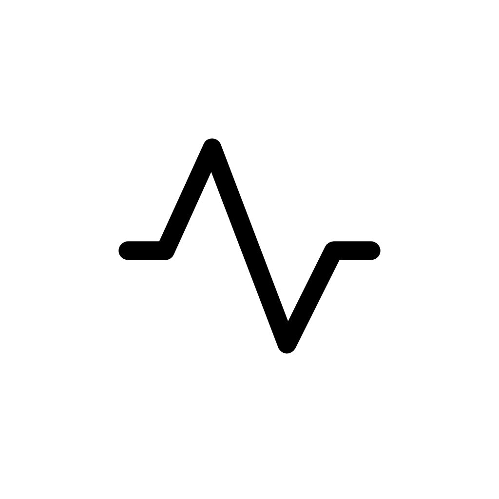

  <!-- Replace the src with your actual logo path -->
  
  
  # SugarTrack Pro
  
  **Master Your Glucose. Master Your Life.**  
  A beautifully crafted, fully responsive clinical tracker designed for absolute privacy and built for offline speed.
  
  
  
  
  
  <h3>
    👉 <a href="https://mmssb.github.io/sugartrack-pro.com">Click Here for the Live Demo</a> 👈
  </h3>

---

## 📖 About SugarTrack

Most health apps trap your data in the cloud, bombard you with ads, or force you into subscriptions. **SugarTrack rejects that model.** 

Engineered as an **offline-first Progressive Web App (PWA)**, SugarTrack guarantees that your sensitive health metrics stay entirely on your device. Powered by our custom **Square UI Pro** system, it delivers an ultra-premium, app-like experience directly in the browser—featuring Apple-style morphing modals, 3D tilt cards, and staggered animations with absolutely zero latency.

---

## 📸 Screenshots

  <table>
    <tr>
      <td align="center"><b>Light Mode</b></td>
      <td align="center"><b>Dark Mode</b></td>
    </tr>
    <tr>
      <!-- Replace these src links with your actual screenshot paths -->
      <td></td>
      <td></td>
    </tr>
  </table>

---

## ✨ Key Features

- ⚡ **Fluid Square UI Engine:** Custom-built interface with draggable bottom sheets, Apple-style morphing modals, and 3D parallax effects.
- 🔒 **100% Local Privacy:** Powered by IndexedDB and LocalStorage. Your data never touches a remote server unless you explicitly export it.
- 📊 **Intelligent Analytics:** Real-time visual charting (via Chart.js) that calculates averages and time-in-range instantly.
- 📄 **Clinical Exports:** Generate high-quality bilingual (English & Arabic) PDF medical reports natively.
- 💾 **Universal Data Formats:** Export your raw logs to JSON or Excel (`.xlsx`).
- 🎨 **Dynamic Theming:** Seamless Light, Dark, and System mode syncing with a customizable Accent Color engine.
- 📱 **PWA Ready:** Install directly to your iOS or Android home screen for a native app experience.

---

## 🛠 Tech Stack & Architecture

SugarTrack is built with performance and independence in mind. It uses zero heavy frameworks, ensuring lightning-fast load times.

* **Frontend:** Pure Vanilla HTML5, CSS3, and Modular JavaScript (ES6+).
* **Design System:** Custom "Square UI Pro" framework with CSS variables and Intersection Observers.
* **Icons:** Phosphor Icons.
* **Data Visualization:** Chart.js.
* **Export Engines:** `html2pdf.js` for clinical reports, `SheetJS` for Excel parsing.
* **Deployment Ready:** Configured for seamless deployment on Vercel, Google Cloud Platform (GCP), or Docker containerization.

---

## 🚀 Version History

### **v1.0.0 Pro (Current Release)**
- Initial Pro architecture release with responsive Square UI System.
- Added fully bilingual Clinical PDF Exports.
- Implemented Local-First data storage and offline caching.
- Introduced dynamic Accent Colors and Dark Mode engine.
- Integrated Apple-style morphing modals and 3D tilt interactions.

---

## 🗺 Future Roadmap

- [ ] **Cloud Sync API:** Optional opt-in sync using Supabase/Firebase.
- [ ] **AI Integration:** Dietary and lifestyle insights powered by Gemini API.
- [ ] **Smartwatch Integration:** Push notifications and quick-logging via wearOS/watchOS.
- [ ] **Continuous Glucose Monitor (CGM) Sync:** Automated reading imports.

---

## 👨‍💻 The Team

**MMS** — *Lead Developer & Architect*  
Passionate about building fluid, user-centric healthcare tools. Engineered SugarTrack from the ground up to combine beautiful UI with powerful clinical utilities, focusing on speed, responsiveness, and clean vanilla architecture.
* [GitHub Profile](https://github.com/MMSSB)

---

  <i>If you found this project helpful, please consider giving it a ⭐ on GitHub!</i>

